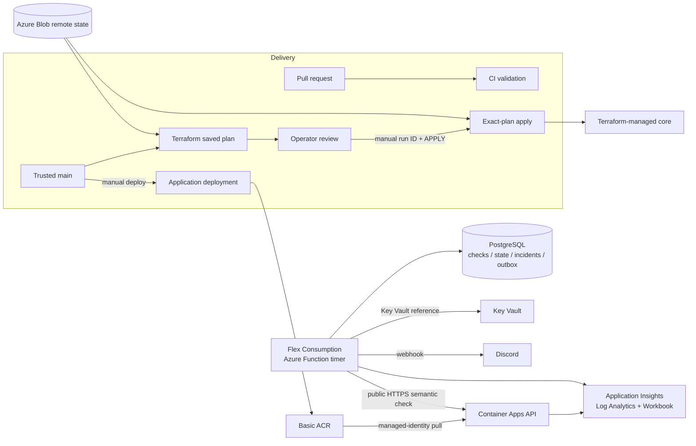

# Architecture and resource ownership

This document describes the final repository and the live inventory audited on
2026-10-05 UTC. It deliberately separates the persistent platform from the
temporary Phase 9 lab.

## Persistent architecture



The API does not write incident data. The checker is outside the workload, so
an application process cannot declare its own outage healthy. The Function
calls the same checker, state transition, PostgreSQL, outbox, and delivery
modules used by local tests; it is a thin timer adapter rather than a second
monitor implementation.

### Persistent resource classification

| Resource | Purpose | Ownership |
|---|---|---|
| `rg-arp-app-wus3` | Project resource boundary | Terraform `infra/app` |
| Basic ACR | Immutable application and monitor images | Terraform |
| API user-assigned identity + ACR pull role | Secretless image pull | Terraform |
| Container Apps environment and API | Public HTTPS workload, one fixed replica | Terraform |
| Log Analytics, Application Insights, Workbook | Azure-native logs, requests, latency, investigations | Terraform |
| Function identity, LRS storage/container, Key Vault, FC1 plan, Function | Scheduled external monitor and secretless host storage | Terraform |
| PostgreSQL Flexible Server | Durable checks, state, incidents, notifications | Shared/external dependency; intentionally not in current Terraform state |
| `ca-arp-monitor-wus3` | Historical Container Apps scheduler retained for rollback history | Intentionally manual; resource explicitly stopped, every revision inactive with zero replicas |
| Application Insights smart-detection action group | Platform-created supporting resource | Azure-managed |
| State resource group, storage account, container | Remote Terraform state | Bootstrap/shared control plane; not managed from `infra/app` |
| Four GitHub OIDC applications and their assignments | Deploy, plan, app apply, and repeatable Phase 9 apply | Control-plane identities; audited separately |

The application state currently contains 18 managed instances. A trusted-main
plan at commit `7ddc655b40c8957540881a54f847429851346372` produced zero
creates, reads, updates, replacements, or deletes. This confirms that the
Terraform-managed subset has no unexplained drift. PostgreSQL and the inactive
legacy monitor remain explicit boundaries rather than being falsely presented
as Terraform-managed.

The application deployment workflow updates only the API. It deliberately does
not publish or update the retired monitor definition, so a future API release
cannot accidentally reactivate that scheduler. The monitor image is still
built in CI to keep its local/rollback packaging tested. The Azure Function is
the sole active scheduler.

## Temporary Phase 9 architecture

```mermaid
flowchart LR
  P9TF[Isolated Phase 9 Terraform state] --> AKS[AKS Free tier<br/>one Standard_D2as_v4 node]
  ACR[Existing ACR] -->|digest-pinned image| API[API Deployment + public LoadBalancer]
  AKS --> API
  API --> METRICS[/metrics]
  METRICS --> PROM[Prometheus]
  KSM[kube-state-metrics] --> PROM
  PROM --> GRAFANA[Grafana ClusterIP]
  PROM --> ALERTMANAGER[Alertmanager ClusterIP]
  ALERTMANAGER --> DISCORD[Discord]
  FUNCTION[External Azure Function] -->|outside cluster, public endpoint| API
```

The lab did not use Managed Prometheus, Managed Grafana, another database,
additional node pools, autoscaling, a service mesh, or a gateway. Grafana,
Prometheus, Alertmanager, and kube-state-metrics ran inside the cluster.
Grafana and the other observability services stayed private and were reached
only through local port-forwarding during the experiment.

After evidence capture, Helm workloads and the application load balancer were
removed, and the separately reviewed Terraform destroy removed the AKS cluster
and both tracked role assignments. The node resource group is absent and the
isolated `phase9.terraform.tfstate` has serial 5 with zero managed resources
and no outputs. The chart, Terraform root, scripts, and sanitized evidence stay
version-controlled so the lab is reproducible without implying it is running.

## Why these technologies

| Choice | Reason and tradeoff |
|---|---|
| Container Apps | Small operational surface for the persistent HTTP service while retaining revisions, managed ingress, probes, and managed-identity ACR pulls. It is not a Kubernetes portability claim. |
| Azure Function timer | A scheduler outside the monitored workload with consumption-oriented execution and direct reuse of tested Python modules. Its one-minute cadence limits detection resolution. |
| PostgreSQL | Durable transactions and row-level locking provide real cross-process serialization; SQLite remains useful only for local/unit behavior. The live server is deliberately small and non-HA. |
| Application Insights / Log Analytics | Native request, trace, latency, and investigation tooling. HTTP success cannot validate the response body, which Incident #2 exposed. |
| Terraform + Azure Blob backend | Reviewable desired state with shared remote state and blob-lease serialization. Manual/external resources remain named limitations. |
| GitHub Actions OIDC | Short-lived Azure tokens with no stored client secret and distinct roles per workflow. |
| AKS + Prometheus stack | A bounded lab for Kubernetes rollout, rollback, scraping, dashboards, and alert routing without imposing permanent cluster cost. |

## Data and control flow

1. The Function timer calls the public `/health` endpoint.
2. The checker records timestamp, HTTP status, latency, semantic result, and
   sanitized error information.
3. In one PostgreSQL transaction, `monitor_state` is locked, the state machine
   evaluates the threshold, a check row is written, and any incident/outbox
   transition is persisted.
4. Pending outbox records are delivered to Discord. A failed delivery records
   its attempt/error and remains retryable.
5. Application and Function structured logs flow to Log Analytics; HTTP request
   telemetry flows to Application Insights. The Workbook supports investigation.
6. Deployment builds a commit-tagged API image, updates the named API Container App,
   then verifies the exact API revision after full traffic cutover.

The state machine is documented by [ACT-2](phase2-external-checker.md) and the
[concurrency proof](phase5-concurrency.md). Live behavior is documented by
[Incident #2](incidents/incident-002.md).
